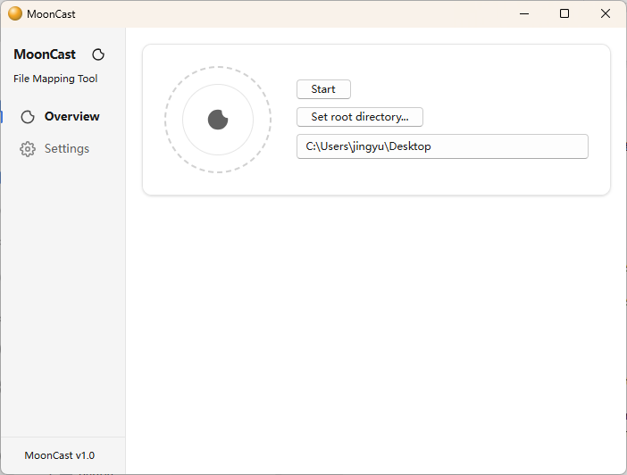
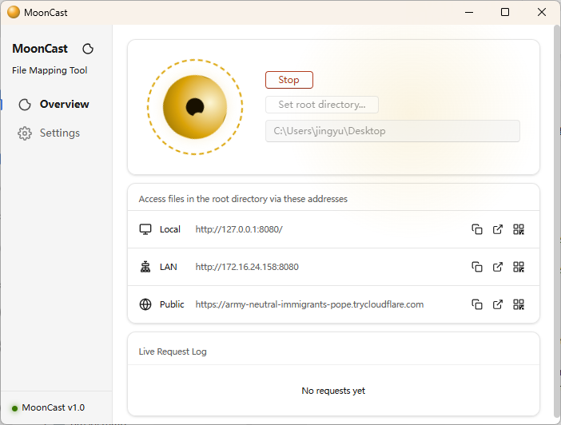

<p align="center">
  
</p>

<h1 align="center">MoonCast</h1>

<p align="center">
  A cross-platform desktop app for casting, browsing, and sharing local files across devices.
</p>

<p align="center">
  
  
  
</p>

<p align="center">
  <a href="README.zh-CN.md">简体中文</a>
  ·
  <a href="https://github.com/ethan321222/moon-cast/releases">Releases</a>
  ·
  <a href="https://github.com/ethan321222/moon-cast/issues">Report an issue</a>
</p>

## Screenshot

| Ready | Serving |
|:---:|:---:|
|  |  |

## Overview

MoonCast turns a local folder into a lightweight file portal. Start the desktop app, choose a root directory, and open the generated address from another device on the same network. The browser UI supports file browsing, media preview, QR code sharing, uploads, folder creation, rename, and delete operations.

It is built with Tauri, React, TypeScript, Rust, and Axum.

## Features

- 🚀 Share local folders over LAN or a public Cloudflare Tunnel.
- 🌐 Access files from phones, tablets, and computers through a browser.
- 🖼️ Stream video on the fly — no need to download the entire file first.
- 💽 Mount the shared folder as a WebDAV network drive.
- 🔐 Protect browser and WebDAV access with optional password authentication.

## WebDAV Modes

WebDAV is disabled by default.

When WebDAV is enabled without password authentication, MoonCast runs it in read-only mode. Clients can browse and download files, but upload, delete, move, rename, folder creation, and other file operations are rejected.

When authentication is enabled with a username and password, WebDAV read/write operations are allowed.

## Installation

Download the latest installer from the [Releases](https://github.com/ethan321222/moon-cast/releases) page.

Available bundle formats depend on the release build:

- Windows: `.exe`, `.msi`, or `.zip`
- macOS: `.dmg`
- Linux: `.deb` or `.AppImage`

## Usage

1. Open MoonCast.
2. Select the folder you want to share.
3. Start the server.
4. Open the local, LAN, or tunnel address from another device.
5. Scan the QR code for faster mobile access.

For access outside your local network, enable the Cloudflare Tunnel option. Use password authentication before exposing private files over a public address.

## Development

### Requirements

- Node.js 20+
- npm
- Rust stable
- Platform requirements for Tauri v2

Linux builds also need the WebKit and GTK dependencies used by Tauri. The GitHub Actions workflow installs:

```bash
sudo apt-get update
sudo apt-get install -y \
  libwebkit2gtk-4.1-dev \
  librsvg2-dev \
  patchelf \
  libgtk-3-dev \
  libayatana-appindicator3-dev
```

### Commands

```bash
npm ci
npm run dev
```

Type-check and build the frontend:

```bash
npm run typecheck
npm run build:renderer
```

Build the desktop app:

```bash
npm run build
```

Check the Rust backend:

```bash
cargo check --manifest-path src-tauri/Cargo.toml
```

## Project Structure

```text
src/                     React frontend
src/components/          Shared UI components
src/pages/control/       Desktop control panel (dashboard & settings)
src/pages/browser/       Browser file explorer & media preview
src-tauri/               Tauri and Rust backend
public/                  Static assets & screenshots
.github/workflows/       CI and release workflow
```

## Contributing

1. Fork the repository.
2. Create a feature branch: `git checkout -b feat/my-feature`.
3. Commit your changes: `git commit -m "feat: add my feature"`.
4. Push and open a pull request.

Please run `npm run typecheck` and `cargo check --manifest-path src-tauri/Cargo.toml` before submitting.

## Security Notes

- MoonCast can expose local files to other devices on the network.
- Prefer enabling password authentication when sharing sensitive folders.
- WebDAV write operations require authentication.
- Public tunnel access should be used carefully and only with authentication enabled.
- Hidden files are not shown by default.

## License

MoonCast is released under the MIT License.
