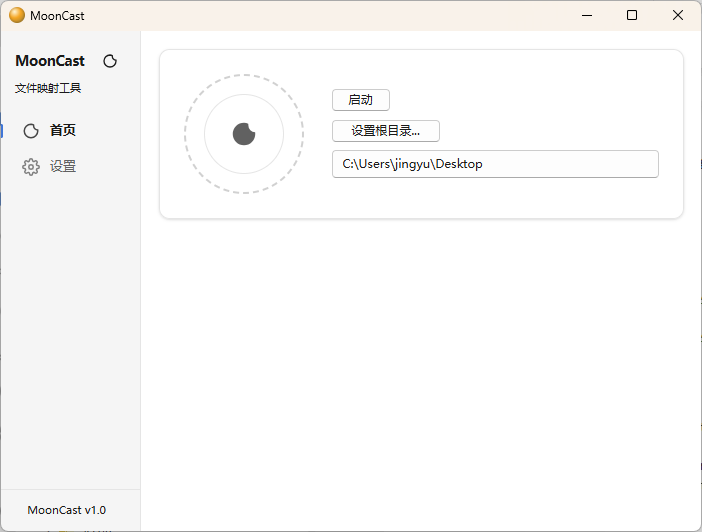
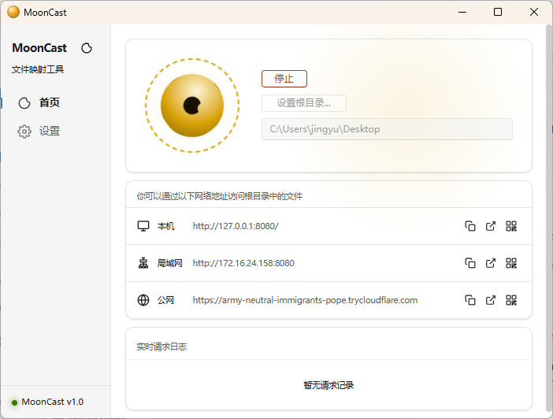

<p align="center">
  
</p>

<h1 align="center">MoonCast</h1>

<p align="center">
  一个跨平台桌面文件投送工具，用于在多台设备之间浏览、预览和共享本地文件。
</p>

<p align="center">
  
  
  
</p>

<p align="center">
  <a href="README.md">English</a>
  ·
  <a href="https://github.com/ethan321222/moon-cast/releases">下载发布版</a>
  ·
  <a href="https://github.com/ethan321222/moon-cast/issues">反馈问题</a>
</p>

## 截图

| 就绪 | 服务中 |
|:---:|:---:|
|  |  |

## 简介

MoonCast 可以把本地文件夹映射为一个轻量的文件访问入口。启动桌面端，选择根目录后，其他设备就可以通过局域网地址访问这个文件夹。浏览器页面支持文件浏览、媒体预览、二维码分享、上传、新建文件夹、重命名和删除等操作。

项目基于 Tauri、React、TypeScript、Rust 和 Axum 构建。

## 功能特性

- 🚀 支持局域网共享，也支持通过 Cloudflare Tunnel 公网访问。
- 🌐 手机、平板、电脑都可以直接用浏览器访问文件。
- 🖼️ 支持视频流式传输，无需完整下载即可在线播放。
- 💽 支持 WebDAV，可挂载为网络磁盘。
- 🔐 支持密码认证，保护浏览器和 WebDAV 访问。

## WebDAV 模式

WebDAV 默认关闭。

如果启用 WebDAV 但没有启用密码认证，MoonCast 会以只读模式运行 WebDAV。客户端可以浏览和下载文件，但上传、删除、移动、重命名、新建文件夹等写操作会被拒绝。

如果启用了用户名和密码认证，WebDAV 才允许读写操作。

## 安装

从 [Releases](https://github.com/ethan321222/moon-cast/releases) 页面下载最新安装包。

可用格式取决于发布构建：

- Windows：`.exe`、`.msi` 或 `.zip`
- macOS：`.dmg`
- Linux：`.deb` 或 `.AppImage`

## 使用方式

1. 打开 MoonCast。
2. 选择要共享的本地文件夹。
3. 启动服务。
4. 在其他设备上打开本机、局域网或公网访问地址。
5. 手机访问时可以直接扫描二维码。

如果需要在局域网外访问，可以启用 Cloudflare Tunnel。公开访问私人文件前，请先启用密码认证。

## 本地开发

### 环境要求

- Node.js 20+
- npm
- Rust stable
- Tauri v2 所需平台依赖

Linux 构建还需要 Tauri 依赖的 WebKit 和 GTK 组件。GitHub Actions 中安装的是：

```bash
sudo apt-get update
sudo apt-get install -y \
  libwebkit2gtk-4.1-dev \
  librsvg2-dev \
  patchelf \
  libgtk-3-dev \
  libayatana-appindicator3-dev
```

### 常用命令

```bash
npm ci
npm run dev
```

前端类型检查和构建：

```bash
npm run typecheck
npm run build:renderer
```

构建桌面应用：

```bash
npm run build
```

检查 Rust 后端：

```bash
cargo check --manifest-path src-tauri/Cargo.toml
```

## 项目结构

```text
src/                     React 前端
src/components/          通用 UI 组件
src/pages/control/       桌面控制面板（仪表盘与设置）
src/pages/browser/       浏览器文件管理与媒体预览
src-tauri/               Tauri 与 Rust 后端
public/                  静态资源与截图
.github/workflows/       CI 与发布流程
```

## 参与贡献

1. Fork 本仓库。
2. 创建功能分支：`git checkout -b feat/my-feature`。
3. 提交更改：`git commit -m "feat: add my feature"`。
4. 推送并创建 Pull Request。

提交前请确保通过 `npm run typecheck` 和 `cargo check --manifest-path src-tauri/Cargo.toml`。

## 安全说明

- MoonCast 会把本地文件暴露给网络中的其他设备访问。
- 共享敏感目录时建议启用密码认证。
- WebDAV 写操作需要认证。
- 公网隧道访问应谨慎使用，并建议始终启用认证。
- 默认不显示隐藏文件。

## 许可证

MoonCast 使用 MIT License 开源。
